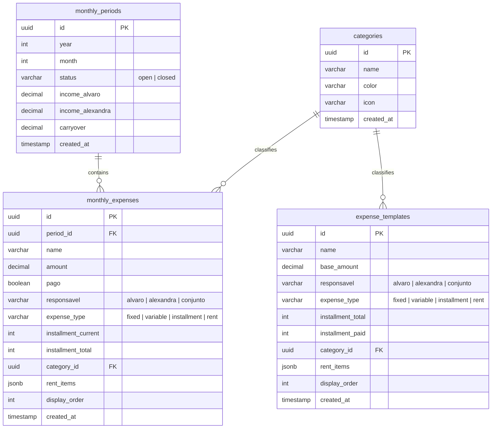

# Nexo Lite — Documentação Oficial do Sistema

O **Nexo Lite** é um ecossistema de controle financeiro mensal para casais, projetado para simplificar o check-in orçamentário e eliminar planilhas complexas. Esta documentação detalha a proposta de valor do sistema, o funcionamento de cada tela e botão, a arquitetura de banco de dados e APIs, as regras de negócio consolidadas e as diretrizes de design.

---

## 1. Proposta de Valor & Dor Resolvida

* **A Dor**: A maioria dos sistemas financeiros exige o lançamento manual diário de cada pequena despesa (ex.: café, padaria), o que gera cansaço e abandono do controle. Além disso, gerenciar contas compartilhadas com parceiros mantendo independência financeira individual cria fricção.
* **A Solução**: O Nexo Lite funciona em formato de **Check-in Mensal**. Foca apenas no que é planejado e relevante (contas de consumo, aluguel, parcelas, fatura do cartão consolidada e investimentos) para calcular o **Saldo Livre** (ou *Free Cash*). O casal sabe exatamente quanto dinheiro sobrou para gastar livremente ou poupar no mês, dividindo a responsabilidade de forma transparente sem misturar contas de forma desordenada.

---

## 2. Manual de Interface: Telas, Fluxos e Botões

Abaixo está o detalhamento minucioso de cada tela da aplicação e o comportamento exato de todos os seus elementos interativos.

### 2.1. Cabeçalho Geral (`AppHeader.vue`)
Presente no topo de todas as visualizações em telas desktop e mobile.

* **Logotipo ("N")**: No mobile, exibe um ícone compacto estilizado; no desktop, o nome completo "Nexo Lite". Clicar no logo redireciona para a tela do Dashboard (Check-in).
* **Navegador de Período temporal (`< Mês Ano >`)**:
  * **Seta Esquerda (`<`)**: Retrocede um mês no histórico. Se o mês anterior já estiver fechado (`closed`), a aplicação carrega-o em Modo Leitura.
  * **Seta Direita (`>`)**: Avança um mês no histórico. Se o mês selecionado não existir no banco de dados, a interface exibe uma tela com um botão de ação para inicializar o período.
  * **Rótulo Central (Ex: "Junho 2026")**: Clicar no nome do mês retorna instantaneamente a visualização para o mês atual do calendário real.
* **Toggle de Dark/Light Mode (Sol / Lua)**: Botão circular minimalista no canto superior direito. Altera o tema visual do sistema e salva a preferência do usuário no `localStorage` sob a chave `theme`.
* **Navegação Desktop**: Links textuais horizontais para alternar entre as abas: **Check-in**, **Estatísticas**, **Recorrências** e **Ajustes**.

---

### 2.2. Tela de Check-in (`DashboardView.vue`)
É a tela principal do sistema, dividida em três seções lógicas:

#### A. Painel de Saldo Reativo (`BalanceSummary.vue`)
Exibe o sumário financeiro de acordo com a aba de perfil selecionada.
* **Abas de Perfil (Visão Geral / Álvaro / Alexandra)**: Alternam o contexto do painel de saldo e filtram a lista de despesas inferior.
* **Linha de Renda Individual (Álvaro / Alexandra)**: Exibe a renda de cada membro.
  * **Comportamento**: Na aba individual do membro, o valor de sua renda é um input de texto editável com máscara financeira em tempo real (`CurrencyInput`). Pressionar `Enter` ou retirar o foco (`blur`) salva o novo valor diretamente no banco de dados.
* **Carryover (Saldo Rolado)**: Exibe o excedente do mês passado herdado pelo período atual.
* **Free Cash (Saldo Livre)**: Indicador visual em destaque que exibe o resultado da fórmula do saldo (Renda + Carryover - Despesas) para o perfil ativo.

#### B. Formulário de Nova Despesa (Acordeão)
Aberto via botão flutuante **"+"** no mobile (localizado no centro do menu inferior) ou via botão fixo no desktop. Oculto quando o mês visualizado está fechado (`closed`).
* **Input "Nome da Despesa"**: Campo de texto para identificar o lançamento.
* **Input "Valor" (`CurrencyInput`)**: Entrada numérica formatada em tempo real com prefixo "R$".
* **Seletor "Quem paga" (`AppSelect`)**: Três opções: `Álvaro` (atribui o débito exclusivamente ao Álvaro), `Alexandra` (atribui exclusivamente à Alexandra) ou `Conjunto` (afeta apenas o saldo livre consolidado do casal).
* **Seletor "Tipo" (`AppSelect`)**:
  * `Fixa`: Despesa padrão com valor constante.
  * `Variável`: Despesa recorrente que entra zerada no início do mês.
  * `Parcelada`: Revela inputs numéricos adicionais: *"Parcela atual"* e *"Total de parcelas"* (ex. 1 de 12).
  * `Aluguel`: Despesa especial de estrutura JSONB.
* **Seletor "Categoria" (`CategoryPicker`)**: Dropdown customizado contendo a paleta de cores e ícones das categorias ativas.
* **Botão "Adicionar"**: Envia a requisição de criação ao backend, atualiza o estado local de forma otimista e limpa o formulário.

#### C. Lista de Lançamentos do Mês
Exibe a relação de gastos do período ativo.
* **Toggle de Status de Pagamento (Checkbox / Switch)**:
  * **Comportamento**: Ao clicar, envia um `PATCH /expenses/{id}/toggle-paid` ao backend. A interface aplica opacidade reduzida e risca o texto da despesa para sinalizar conclusão.
* **Edição de Valor Inline**:
  * **Comportamento**: Um duplo clique no valor da despesa ativa o modo de edição rápida. O campo é substituído por um `CurrencyInput`. Pressionar `Enter` ou remover o foco (`blur`) envia a atualização ao backend. Pressionar `Esc` descarta a edição.
* **Botão Excluir (Lixeira)**:
  * **Comportamento**: Revelado no hover da linha (desktop) ou visível no card (mobile). Abre o modal de confirmação (`ConfirmModal.vue`). Se confirmado, remove a despesa do banco.
* **Botão "Destrinchar Aluguel"** (exclusivo para despesas do tipo `Aluguel`):
  * **Comportamento**: Abre o modal detalhado de Aluguel (`RentModal.vue`).
* **Botão "Virar o Mês"**: Exibido no rodapé do Dashboard. Abre o modal de virada.

---

### 2.3. Modal de Detalhamento do Aluguel (`RentModal.vue`)
O aluguel não possui valor único manual. Ele é a soma de linhas dinâmicas de cobrança do boleto.

* **Lista de Sub-itens**: Exibe o nome e o valor de cada taxa (ex. Aluguel Base, Condomínio, Água, Gás, Taxa CredPago).
* **Botão Excluir Sub-item (Ícone Lixeira)**: Remove a linha de taxa específica instantaneamente da soma.
* **Botão "+ Adicionar Taxa"**: Insere uma nova linha vazia com input de Nome e input de Valor (`CurrencyInput`).
* **Botão "Cancelar"**: Fecha o modal sem persistir alterações.
* **Botão "Salvar"**: Envia o array JSON de sub-itens para o endpoint `PATCH /expenses/{id}/rent`. O backend calcula o total e atualiza o `amount` global da despesa.

---

### 2.4. Tela de Recorrências (`TemplatesView.vue`)
Local de cadastro de gastos repetitivos (templates de despesas).

* **Formulário de Nova Recorrência**: Idêntico ao formulário de novas despesas do Dashboard, com um campo extra:
  * **Checkbox "Adicionar ao mês atual também"**: Se marcado, cria simultaneamente o template de recorrência e uma despesa física correspondente na lista do mês corrente.
* **Lista de Recorrências**: Exibe os templates ativos no banco de dados.
  * **Card Mobile Inteligente**: Posiciona o nome em destaque na linha superior com largura total útil. O badge de categoria e o tipo (Fixa, Variável, Parcelada, Aluguel) são alinhados lado a lado na linha de baixo para evitar truncagem de texto em aparelhos pequenos.
  * **Botão Excluir Template (Lixeira)**: Abre modal de confirmação. A remoção de um template impede que ele seja clonado nos meses futuros, mas não apaga as despesas históricas criadas por ele em períodos passados.

---

### 2.5. Tela de Ajustes (`SettingsView.vue`)
Central de configurações globais e cadastros de infraestrutura do sistema.

* **Seção "Membros e Rendas"**:
  * **Botão "Salvar"**: Localizado no rodapé do card (canto inferior direito). Executa o salvamento unificado dos nomes configurados (na store/localStorage) e das rendas dos membros (no banco de dados PostgreSQL) de uma única vez.
  * **Inputs "Membro 1" e "Membro 2"**: Permitem alterar os nomes e as rendas. Pressionar `Enter` em qualquer um dos campos também dispara a ação de salvar.
  * **Inputs de Renda**: Integrados com a máscara financeira em tempo real (`CurrencyInput`), desabilitados caso o mês ativo esteja fechado.
* **Seção "Categorias de Despesa"**:
  * **Botão "+ Categoria"**: No mobile, exibe o formulário de cadastro de categorias; no desktop, foca o cursor do teclado no formulário lateral.
  * **Inputs do Formulário de Categoria**:
    * **Nome da Categoria**: Campo de texto.
    * **Seletor de Cor**: Grade interativa contendo 12 cores curadas do design system Stripe.
    * **Seletor de Ícone**: Grade com 30 ícones Lucide pré-selecionados para finanças.
  * **Lista de Categorias**: Exibe as categorias ativas com seus respectivos ícones e cores. Cada item possui um botão de exclusão que remove a categoria (despesas vinculadas a ela passam a ter `category_id = NULL`).

---

## 3. Arquitetura Técnica & Banco de Dados

O sistema utiliza PostgreSQL (gerenciado via Supabase) com controle estrutural por migrations SQL nativas.

### 3.1. Schemas de Banco de Dados
* **`monthly_periods`**: Registra cada competência mensal. Controla o estado de edição (`status`) e as rendas configuradas do mês.
* **`monthly_expenses`**: Contém todos os lançamentos reais de despesa vinculados a um período específico.
* **`expense_templates`**: Mantém os modelos de despesas que o motor de virada utiliza para povoar automaticamente o novo mês criado.
* **`categories`**: Guarda as customizações de categoria, incluindo a cor (CSS classe correspondente) e a string identificadora do ícone Lucide.

---

## 4. Endpoints da API (Backend)

O backend em FastAPI fornece os seguintes endpoints essenciais:

### Períodos (`/api/periods`)
* `GET /api/periods/current`: Retorna o período aberto ativo.
* `GET /api/periods/{year}/{month}`: Retorna o período para a data especificada (usado na navegação temporal).
* `POST /api/periods/turnover`: Aciona o motor de transição de mês, fechando o atual e criando o próximo.
* `PATCH /api/periods/{id}/income`: Atualiza os salários de Álvaro e Alexandra no período ativo.

### Despesas (`/api/expenses`)
* `POST /api/expenses`: Cria um novo lançamento de despesa.
* `PATCH /api/expenses/{id}`: Atualiza campos parciais da despesa (nome, responsável, etc.).
* `PATCH /api/expenses/{id}/toggle-paid`: Inverte o estado de pagamento (`pago = !pago`).
* `PATCH /api/expenses/{id}/rent`: Atualiza o array JSONB de sub-itens do aluguel e recalcula o total.
* `DELETE /api/expenses/{id}`: Remove a despesa do banco.

### Templates (`/api/templates`)
* `GET /api/templates`: Lista todos os templates ativos.
* `POST /api/templates`: Cria um novo template.
* `DELETE /api/templates/{id}`: Exclui o template especificado.

---

## 5. Regras de Negócio Fundamentais (RN-01 a RN-10)

1. **RN-01 (Banco de Dados Inicial Vazio)**: O sistema não possui sementes de dados fictícios para produção. Novos usuários iniciam com tabelas limpas; a primeira competência e as recorrências devem ser cadastradas manualmente.
2. **RN-02 (Titularidade e Filtros)**:
   * Despesas atribuídas a `alvaro` constam apenas no saldo individual dele e no saldo consolidado geral.
   * Despesas atribuídas a `alexandra` constam apenas no saldo individual dela e no saldo consolidado geral.
   * Despesas atribuídas a `conjunto` constam **somente** no saldo geral do casal.
3. **RN-03 (Fórmula de Saldos Livres)**:
   $$\text{Saldo Álvaro} = \text{Renda Álvaro} - \sum(\text{Despesas Álvaro})$$
   $$\text{Saldo Alexandra} = \text{Renda Alexandra} - \sum(\text{Despesas Alexandra})$$
   $$\text{Saldo Geral} = (\text{Renda Álvaro} + \text{Renda Alexandra}) + \text{Carryover Anterior} - \sum(\text{Todas as Despesas})$$
4. **RN-04 (Cálculo de Carryover/Rollover)**: O rollover de saldo acumulado positivo do período encerrado é injetado no novo período:
   $$\text{Carryover Novo} = \max(0, \text{Saldo Geral Anterior})$$
   *Caso o mês anterior feche com saldo negativo, o Carryover do mês seguinte será exatamente zero (não há repasse de dívida/déficit).*
5. **RN-05 (Status do Período)**:
   * Status `'closed'`: O período torna-se estático e somente leitura. Formulários são ocultados e inputs desativados.
   * Status `'open'`: Permite edições e lançamentos dinâmicos.
6. **RN-06 (Funcionamento do Motor de Virada)**: Ao rodar a virada:
   * Altera o status do período atual para `'closed'`.
   * Calcula o Carryover resultante.
   * Cria o registro do próximo mês cronológico.
   * Varre a tabela `expense_templates` e cria despesas em `monthly_expenses` vinculadas ao novo mês:
     * Templates `fixed` e `variable` são copiados com os valores bases.
     * Templates `rent` são gerados zerados com a estrutura de chaves padrão.
     * Templates `installment` são clonados incrementando o contador da parcela corrente.
7. **RN-07 (Integridade do Aluguel)**: O valor principal (`amount`) de despesas do tipo `rent` não pode ser editado pelo usuário. Ele é derivado obrigatoriamente da somatória das taxas cadastradas no modal detalhado de aluguel.
8. **RN-08 (Tratamento Numérico Seguro)**: Visando eliminar erros de ponto flutuante do JavaScript e Python:
   * No backend, todas as strings/números numéricos passam pela utilidade `safe_decimal()` que converte valores em objetos `Decimal` de precisão fixa e trata `None` como `0.00`.
   * No frontend, conversores numéricos aplicam fallbacks `|| 0` para evitar o armazenamento de `NaN` ou `null` no banco de dados.
9. **RN-09 (Ciclo de Vida das Parcelas)**: O template de parcelamento mantém `installment_paid` (número de parcelas já quitadas) e `installment_total` (limite contratado).
   * A cada virada de mês, `installment_paid` é incrementado no template.
   * Se `installment_paid >= installment_total`, o template é considerado **expirado** e não é clonado nos meses subsequentes.
10. **RN-10 (Segurança do Modo Leitura)**: Tentativas de submeter dados para rotas de modificação (`POST`, `PATCH`, `DELETE`) de despesas pertencentes a períodos fechados são bloqueadas no backend por validações de estado do período correspondente.

---

## 6. Padrões de Design & UX (Stripe UI)

O visual é norteado por minimalismo sofisticado e foco na legibilidade numérica:
* **Tipografia Tabular**: Elementos numéricos monetários utilizam a classe `.font-tabular` (habilitando `font-feature-settings: "tnum"`) que garante que todos os números possuam a mesma largura horizontal, mantendo tabelas e listas alinhadas perfeitamente.
* **Componentes Customizados**:
  * `CurrencyInput.vue`: Máscara em tempo real que formata a digitação no padrão financeiro brasileiro (R$ 0,00).
  * `ConfirmModal.vue`: Modal elegante com fundo desfocado (`backdrop-blur`) para decisões críticas como deleções.
  * `AppSelect.vue`: Componente drop-down padronizado com chevron interno do Lucide Icons, evitando estilizações nativas discrepantes entre navegadores.
  * `BaseModal.vue`: No mobile, desliza de baixo para cima (Slide-Up) cobrindo toda a tela de forma confortável; no desktop, surge centralizado com escurecimento de fundo. Controla o scroll do corpo da página para evitar rolagem dupla.
