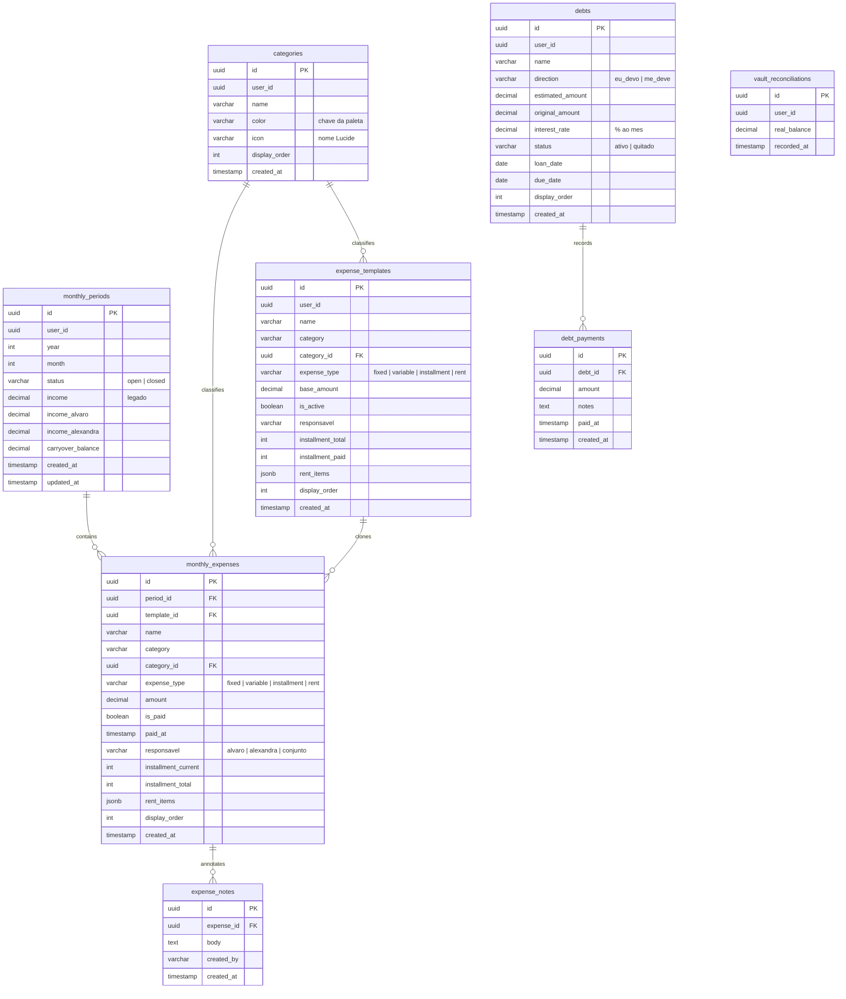

# Nexo Lite — Documentação Oficial do Sistema

O **Nexo Lite** é um ecossistema de controle financeiro mensal para casais, projetado para simplificar o check-in orçamentário, **acelerar a quitação de dívidas** e eliminar planilhas complexas. Esta documentação detalha a proposta de valor, o funcionamento de cada tela e botão, a arquitetura de banco de dados e APIs, as regras de negócio consolidadas e as diretrizes de design.

> **Manutenção:** este documento deve ser atualizado sempre que telas, endpoints, schema ou regras mudarem. Fontes de verdade complementares: `regras.md` (regras de negócio), `MEMORY.md` (histórico de decisões), `COMPONENTS.md` (biblioteca de UI) e `TODO.md` (tarefas).

---

## 1. Proposta de Valor & Dor Resolvida

* **A Dor**: A maioria dos sistemas financeiros exige o lançamento manual diário de cada pequena despesa (ex.: café, padaria), o que gera cansaço e abandono do controle. Gerenciar contas compartilhadas mantendo independência financeira individual cria fricção. E, quando há dívidas, falta clareza sobre **qual quitar primeiro** e **quando se ficará livre**.
* **A Solução**: O Nexo Lite funciona em formato de **Check-in Mensal**. Foca no que é planejado e relevante (contas de consumo, aluguel, parcelas, fatura consolidada do cartão e aportes) para calcular o **Saldo Livre** (*Free Cash*). Sobre essa base, agrega três pilares:
  1. **Caixinha** — reserva financeira (poupança) acompanhada mês a mês, com rendimento conciliado.
  2. **Dívidas & Empréstimos** — cadastro de quem você deve / quem te deve, com pagamentos parciais e quitação.
  3. **Plano de Quitação** — motor que projeta, com base na estratégia escolhida (Bola de Neve ou Avalanche) e no aporte mensal, **em que mês você fica livre** e **quanto pagará de juros**.

---

## 2. Stack Tecnológica

| Camada    | Tecnologia                                                        |
|-----------|-------------------------------------------------------------------|
| Frontend  | Vue 3 (Composition API) + Pinia + Vue Router + Tailwind CSS        |
| Gráficos  | SVG puro / divs (sem libs de chart)                               |
| Ícones    | Lucide (`lucide-vue-next`)                                         |
| HTTP      | Axios                                                              |
| Backend   | FastAPI + SQLAlchemy 2 (async) + Pydantic v2                       |
| Driver DB | `psycopg[binary]` (PostgreSQL)                                     |
| Banco     | Supabase (PostgreSQL), versionado por migrations SQL nativas      |
| PWA       | `vite-plugin-pwa` (instalável, service worker, precache offline)   |

Sem bibliotecas de componentes de UI (Vuetify, PrimeVue etc.) — todo o design é feito em Tailwind sobre um design system próprio inspirado no Stripe.

---

## 3. Manual de Interface: Telas, Fluxos e Botões

Detalhamento de cada tela e o comportamento exato de seus elementos interativos.

### 3.0. Tela de Acesso (`AuthView.vue`)
Porta de entrada do app, exibida quando não há sessão (`sessionStorage.nexo_authenticated !== '1'`). Encadeia estágios animados:

* **Splash** → **Intro** (efeito *typewriter*: "Organize.", "Controle.", "Nexo Lite.").
* **Vínculo de dispositivo** ("De quem é este dispositivo?"): seleção de perfil (Álvaro / Alexandra). A escolha é salva em `localStorage.nexo_owner`.
* **Cofre (Vault)**: tela de autenticação com saudação personalizada por horário.
  * **Biometria (WebAuthn)**: botão de impressão digital. No primeiro uso registra a credencial da plataforma; nos seguintes solicita verificação. A credencial é guardada em `localStorage.nexo_biometric_<perfil>`.
  * **PIN**: teclado numérico de 4 dígitos como alternativa à biometria (botão discreto "PIN"). Vibração tátil e animação de erro (shake).
  * **Trocar de perfil**: limpa o perfil vinculado e volta ao estágio de vínculo.
* Ao autenticar, grava `sessionStorage.nexo_authenticated = '1'`, carrega as categorias e redireciona para o Check-in.

> **Nota de segurança (estado atual):** a autenticação é local/cosmética — adequada para um app pessoal de 2 pessoas. Ver seção **8. Autenticação e Segurança**.

---

### 3.1. Cabeçalho Geral (`AppHeader.vue`)
Presente no topo de todas as telas (desktop e mobile), com *safe-area* para notch iOS.

* **Logotipo ("N")**: no mobile, ícone compacto; no desktop, "Nexo". Clicar redireciona ao Check-in.
* **Navegador de período (`< Mês Ano >`)**:
  * **Seta Esquerda (`<`)**: retrocede um mês. Meses fechados (`closed`) abrem em **Modo Leitura**.
  * **Seta Direita (`>`)**: avança um mês. Mês inexistente exibe estado vazio com CTA de virada.
  * **Rótulo central**: clicar retorna ao mês atual real. Exibe a tag "fechado" quando em modo leitura.
* **Atalho "+ Despesa" (desktop, só no Check-in editável)**: abre o formulário de nova despesa.
* **Toggle de Privacidade (ícone de olho)**: oculta/revela todos os valores monetários, substituindo-os por `R$ ••••`. Persistido em `localStorage.nexo_privacy`. Útil para usar o app em público.
* **Toggle de Tema (Sol / Lua)**: alterna Light/Dark Mode, salvo em `localStorage.theme`.
* **Indicador "Salvando"**: ponto pulsante exibido durante requisições de escrita.
* **Navegação Desktop**: Check-in · Estatísticas · Recorrências · Ajustes.

---

### 3.2. Tela de Check-in (`DashboardView.vue`)
Tela principal. Suporta **pull-to-refresh** no mobile (puxar para baixo no topo recarrega o mês).

#### A. Painel de Saldo Reativo (`BalanceSummary.vue`)
* **Abas de Perfil (Visão Geral / Álvaro / Alexandra)**: trocam o contexto do painel e filtram a lista de despesas.
* **Renda Individual**: na aba do membro, a renda é editável (`CurrencyInput`); `Enter`/`blur` salva no banco.
* **Carryover (Saldo Rolado)**: excedente herdado do mês anterior.
* **Free Cash (Saldo Livre)**: indicador em destaque (Renda + Carryover − Despesas) para o perfil ativo.
* **Bloco de Gamificação** (quando há dados): nota de saúde do mês (A–D), missão/meta mensal de aporte, *streak* e **Poder de Quitação** — barra de progresso da Caixinha rumo à próxima dívida-alvo, com estimativa de meses para quitar. (Ver `useGamification.js`.)
* O painel pode ser recolhido; estado salvo em `localStorage.nexo_balance_collapsed`.

#### B. Formulário de Nova Despesa (Acordeão)
Aberto via FAB **"+"** (mobile) ou atalho no header (desktop). Oculto em meses fechados.
* **Nome**, **Valor** (`CurrencyInput`), **Quem paga** (`AppSelect`: Álvaro / Alexandra / Conjunto), **Tipo** (`AppSelect`):
  * `Fixa` — valor constante.
  * `Variável` — entra zerada a cada mês.
  * `Parcelada` — revela "Parcela atual" e "Total de parcelas".
  * `Aluguel` — despesa de estrutura JSONB (sub-itens).
* **Categoria** (`CategoryPicker`) e **Botão "Adicionar"** (criação otimista).

#### C. Busca
* **Campo "Buscar despesa…"**: filtra a lista do mês por nome em tempo real, com botão de limpar. O estado vazio diferencia "nenhuma despesa encontrada" de "nenhuma despesa neste mês".

#### D. Lista de Lançamentos (`ExpenseCard.vue` mobile / `ExpenseTable.vue` desktop)
* **Clique no item**: abre o **Modal de Detalhes** (ver 3.4).
* **Toggle de Pagamento**: `PATCH /expenses/{id}/toggle-paid`; aplica opacidade + texto riscado.
* **Edição de Valor Inline**: ativa `CurrencyInput`; `Enter`/`blur` salva, `Esc` cancela. (Bloqueada para `rent`.)
* **Menu de 3 pontinhos**: Ver detalhes · Editar · Excluir (com `ConfirmModal` + undo otimista).
* **Despesa "Caixinha"**: item protegido — **não pode ser excluído** (o backend retorna 403). Representa o aporte do mês na reserva.
* **Aluguel**: abre o `RentModal` (ver 3.3).
* **Rodapé "Virar o Mês"**: abre o `TurnoverModal` com preview do carryover.

---

### 3.3. Modal de Detalhamento do Aluguel (`RentModal.vue`)
O aluguel não tem valor único manual; é a soma de linhas dinâmicas (`rent_items` JSONB).
* **Sub-itens**: cada um com nome, valor (`CurrencyInput`) e tipo (`fixo` / `variável` / `parcela`). Itens `parcela` têm contador `current/total`; itens `variável` zeram a cada virada.
* **"+ Adicionar Taxa"** / **Excluir Sub-item** / **Cancelar**.
* **"Salvar"**: envia o array para `PATCH /expenses/{id}/rent`; o backend recalcula `amount` pela soma.

---

### 3.4. Modal de Detalhes da Despesa (`ExpenseDetailModal.vue`)
Visualização estruturada de qualquer despesa:
* Nome, valor, status de pagamento, categoria (ícone + cor), responsável e progresso de parcelas.
* Composição detalhada de sub-itens quando for `aluguel`.
* **Observações (notas)**: histórico de anotações livres por despesa (`expense_notes`), com autor e data. Permite adicionar e remover notas (`GET/POST/DELETE /expenses/{id}/notes`).
* Ações rápidas (editar / excluir).

---

### 3.5. Tela de Recorrências (`TemplatesView.vue`)
Cadastro de gastos repetitivos (templates).
* **Formulário de Nova Recorrência**: igual ao do Dashboard, com **"Adicionar ao mês atual também"** (cria template + despesa do mês simultaneamente). Para `Aluguel`, usa o `RentItemsEditor` para montar os componentes do boleto.
* **Lista de Recorrências**: cards com nome, categoria, tipo e resumo de parcelas (pagas/restantes/total). Editar abre o formulário; excluir usa `ConfirmModal` (não apaga histórico, apenas impede clones futuros).
* **Modal de Projeção (`ForecastModal.vue`)** — "Projeção de Recorrências": projeta os **próximos 12 meses** com base nos templates ativos:
  * Cards de resumo: próximo mês, saldo livre projetado, comprometimento em 12 meses, total liberado.
  * Gráfico de barras mês a mês do comprometimento.
  * "Quando você respira": mês em que parcelas terminam e liberam valor.
  * Lista de "Parcelas a terminar", composição por tipo, Top 5 mais pesadas e economia acumulada em 12 meses, com mensagens motivacionais contextuais.

---

### 3.6. Tela de Estatísticas (`StatsView.vue`)
Painel analítico (grid responsivo), também com pull-to-refresh. Cards:

1. **Caixinha (`VaultStats.vue` / `VaultBarChart.vue`)** — reserva financeira:
   * Total depositado (soma dos aportes "Caixinha" pagos em todos os meses).
   * Último saldo real conciliado e **rendimento calculado** (saldo real − total depositado).
   * Histórico de aportes por mês (gráfico de barras).
   * Ação de **conciliação**: informar o saldo real atual da reserva (`POST /vault/reconcile`).
2. **Dívidas Ativas (`DebtsList.vue`)** — quanto a Caixinha já cobre das dívidas. Organizado em três grupos:
   * **Pagáveis** (`eu_devo`, ativas): card de **Foco** (dívida-alvo) + demais. A cobertura da Caixinha é **alocada em cascata** (vai inteira na dívida-foco; o que sobra transborda para as próximas) — sem contagem dupla. Foco pode ser fixado manualmente (`localStorage.nexo_focused_debt_id`) ou cai na menor dívida.
   * **Recebíveis** (`me_deve`): seção "Te devem", sem cobertura de Caixinha.
   * **Quitadas**: seção recolhível, ainda acessível para reabrir.
   * Edição inline de saldo, barra de cobertura por dívida e cobertura geral.
3. **Plano de Quitação (`PayoffPlan.vue`)** — motor de quitação (ver 3.7).
4. **Radar de Comprometimento (`FutureRadarChart.vue`)** — custo total previsto nos próximos 6 meses via templates.
5. **Evolução do Saldo Livre (`FreeCashChart.vue`)** — Free Cash e Carryover dos últimos 6 meses (`GET /periods/history`).
6. **Termômetro de Liquidez (`LiquidityDonut.vue`)** — proporção do orçamento comprometida em despesas fixas + aluguel vs. variáveis + parceladas.
7. **Cabo de Guerra (`WarBar.vue`)** — distribuição da carga financeira do mês entre Álvaro / Alexandra / Conjunto.

---

### 3.7. Plano de Quitação (`PayoffPlan.vue` + `usePayoffPlan.js`)
Motor que transforma a lista de dívidas em um plano de ação. Considera apenas dívidas `eu_devo` ativas com saldo.

* **Seletor de Estratégia**:
  * **Bola de Neve** — ataca a **menor dívida** primeiro (vitórias rápidas, mais motivação).
  * **Avalanche** — ataca o **maior juro** primeiro (paga menos no total). Recebe badge dinâmico "Economiza R$ X".
* **Aporte mensal**: valor editável (`CurrencyInput`) + slider + chips (±). Sugestão automática = média de aportes da Caixinha → free cash → fallback. Persistido em `localStorage` (`nexo_payoff_budget`, `nexo_payoff_strategy`).
* **Resultado (hero)**: "Você fica livre em **Mês/Ano**", com nº de meses e **juros totais** pagos no caminho.
* **Alerta de inviabilidade**: se o aporte for menor que os juros mensais, mostra que o saldo não diminui e sugere um aporte mínimo (~24 meses) com um clique.
* **Comparação de estratégias**: frase explicativa de quanto a Avalanche economiza vs. Bola de Neve (e nudge para preencher os juros quando faltarem).
* **Ordem de ataque (timeline)**: sequência numerada das dívidas, com badge de juros (% a.m.), tag "Próxima" e o mês projetado de quitação de cada uma.

**Simulação (`simulatePayoff`)**: mês a mês, os juros incidem sobre todo o saldo; o aporte é aplicado em ordem de prioridade (alvo primeiro, transbordo), espelhando como a Caixinha é jogada inteira na dívida da vez. Função pura e testável; detecta inviabilidade (aporte ≤ juros mensais).

---

### 3.8. Empréstimos & Dívidas (`LoanModal.vue`)
Modal de domínio para registrar e operar dívidas. Aberto pelo speed-dial do FAB ("Registrar Empréstimo") ou pela lista de dívidas.

* **Direção**: **Me devem** (recebível) ou **Eu devo** (dívida).
* **Campos**: nome, valor, datas (empréstimo e prazo previsto) e, somente para `Eu devo`, **Juros ao mês (% a.m.)** — alimenta o Plano de Quitação. Deixe 0 se não houver juros.
* **Modo detalhe**: cabeçalho com direção, valor, badge de juros (quando > 0), status (Em aberto / Em atraso / Quitado) e barra de progresso quando há pagamentos parciais.
* **Registrar pagamento**: abate o valor do saldo estimado e registra no histórico (`POST /debts/{id}/payments`). Ao zerar, marca como quitado automaticamente.
* **Quitar / Reabrir / Excluir**: alteram o `status` ou removem a dívida (com `ConfirmModal`).

---

### 3.9. Tela de Ajustes (`SettingsView.vue`)
* **Membros e Rendas**: editar nomes (store/localStorage) e rendas do mês (banco) num único "Salvar"; `Enter` também salva. Inputs de renda desabilitados em mês fechado.
* **Categorias de Despesa**: "+ Categoria"; formulário com Nome, **Cor** (12 cores da paleta) e **Ícone** (30 ícones Lucide). Lista com exclusão (despesas vinculadas passam a `category_id = NULL`).

---

### 3.10. Navegação Inferior Mobile (`BottomNav.vue`)
Barra flutuante (Teleport para o body) com 5 posições: **Check-in · Estatísticas · FAB (+) · Recorrências · Ajustes**.
* O **FAB (+)** é ocultado nas telas de Estatísticas e Ajustes.
* No Check-in, o FAB abre um **speed-dial**: "Registrar Empréstimo" e "Nova Despesa". Nas Recorrências, abre o formulário de template.
* O menu se esconde automaticamente quando há modal aberto (observa `overflow-hidden` no body).

---

## 4. Arquitetura Técnica & Banco de Dados

PostgreSQL (Supabase) versionado por migrations SQL sequenciais (`supabase/migrations/NNN_*.sql`). Usuário demo fixo: `00000000-0000-0000-0000-000000000001` (ver seção 8).

### 4.1. Tabelas
* **`monthly_periods`**: cada competência mensal. Controla `status` e as rendas (`income_alvaro`/`income_alexandra`; `income` é legado). Único por `(user_id, year, month)`.
* **`monthly_expenses`**: lançamentos reais do período. Aluguel usa `rent_items` (JSONB). *(As colunas legadas `rent_base/water/gas/extras` foram removidas na migration 009.)*
* **`expense_templates`**: modelos clonados pelo Motor de Virada para o novo mês.
* **`categories`**: cor (chave da paleta) + ícone (nome Lucide). FK `category_id` em despesas/templates (`ON DELETE SET NULL`).
* **`debts`** / **`debt_payments`**: dívidas/empréstimos e seu histórico de pagamentos (`ON DELETE CASCADE`).
* **`vault_reconciliations`**: histórico de conciliações de saldo real da Caixinha.
* **`expense_notes`**: anotações livres por despesa (`ON DELETE CASCADE`).

### 4.2. Migrations (estado atual: 001 → 013)
| # | Descrição |
|---|-----------|
| 001 | Schema inicial (periods, expenses, templates) + índices + triggers `updated_at` |
| 002 | `responsavel` + `income_alvaro`/`income_alexandra` |
| 003 | `rent_items` JSONB (aluguel dinâmico) |
| 004 | Tabela `categories` + `category_id` em despesas/templates |
| 005 | `vault_reconciliations` (Caixinha) |
| 006 | Tabela `debts` |
| 007 | Seed do template "Caixinha" |
| 008 | Garante a despesa "Caixinha" no período |
| 009 | Remove colunas legadas `rent_base/water/gas/extras` |
| 010 | Expande `debts` (direction, status, original_amount, loan_date, due_date) |
| 011 | `debt_payments` (histórico de pagamentos) |
| 012 | `expense_notes` (observações por despesa) |
| 013 | `interest_rate` (% a.m.) em `debts` — motor de quitação |

> Regra: nunca editar uma migration aplicada — criar a próxima numerada.

---

## 5. Endpoints da API (Backend, prefixo `/api`)

### Períodos (`/periods`)
* `GET /current` — período aberto + suas despesas (cria se não existir).
* `GET /{year}/{month}` — período específico (navegação temporal; 404 se inexistente, 422 se mês inválido).
* `GET /history?limit=12` — últimos N meses com `free_cash` e `carryover` (alimenta gráficos).
* `PATCH /{id}/income` — atualiza rendas (bloqueado em período fechado).
* `POST /turnover` — Motor de Virada (400 se não houver período aberto).

### Despesas (`/expenses`)
* `POST /{period_id}` — cria lançamento.
* `PATCH /{id}` — atualiza campos parciais (bloqueia editar `amount` de `rent`).
* `PATCH /{id}/rent` — salva `rent_items` e recalcula `amount`.
* `PATCH /{id}/toggle-paid` — alterna pagamento.
* `DELETE /{id}` — remove (403 para a despesa "Caixinha").
* `GET /{id}/notes` · `POST /{id}/notes` · `DELETE /{id}/notes/{note_id}` — observações.

### Templates (`/templates`)
* `GET /` · `POST /` · `PATCH /{id}` · `DELETE /{id}`.

### Categorias (`/categories`)
* `GET /` · `POST /` · `PATCH /{id}` · `DELETE /{id}`.

### Resumo (`/summary`)
* `GET /{period_id}` — agregados do período (saldos, comprometido/pago, breakdown por categoria).

### Caixinha (`/vault`)
* `GET /summary` — total depositado, último saldo real, rendimento e histórico.
* `POST /reconcile` — registra o saldo real atual.

### Dívidas & Empréstimos (`/debts`)
* `GET /` · `POST /` · `PATCH /{id}` · `DELETE /{id}`.
* `PATCH /{id}/settle` — marca como quitado.
* `POST /{id}/payments` — registra pagamento parcial (abate saldo; quita ao zerar).
* `GET /{id}/payments` — histórico de pagamentos.

### Saúde
* `GET /health` — status do serviço.

---

## 6. Regras de Negócio Fundamentais (RN-01 a RN-10)

1. **RN-01 (Banco Inicial Vazio)**: sem seeds em produção; a primeira competência e as recorrências são cadastradas manualmente.
2. **RN-02 (Titularidade e Filtros)**: `alvaro`/`alexandra` aparecem no saldo individual e no geral; `conjunto` aparece **somente** no saldo geral.
3. **RN-03 (Fórmulas de Saldo)**:
   $$\text{Saldo Álvaro} = \text{Renda Álvaro} - \sum(\text{Despesas Álvaro})$$
   $$\text{Saldo Alexandra} = \text{Renda Alexandra} - \sum(\text{Despesas Alexandra})$$
   $$\text{Saldo Geral} = (\text{Renda Álvaro} + \text{Renda Alexandra}) + \text{Carryover} - \sum(\text{Todas as Despesas})$$
4. **RN-04 (Carryover)**: $\text{Carryover Novo} = \max(0, \text{Saldo Geral Anterior})$ — usa despesas **comprometidas** (não só pagas); nunca propaga déficit.
5. **RN-05 (Status do Período)**: `closed` = somente leitura; `open` = edição plena.
6. **RN-06 (Motor de Virada)**: fecha o atual, calcula carryover, cria o próximo mês e clona templates ativos — `fixed`/`variable` com `base_amount`; `rent` recompondo `rent_items` (variáveis zeram, parcelas incrementam); `installment` incrementando a parcela. Garante a despesa "Caixinha" no novo mês.
7. **RN-07 (Integridade do Aluguel)**: `amount` de `rent` nunca é editado direto — é a soma de `rent_items` via `PATCH /expenses/{id}/rent`.
8. **RN-08 (Tratamento Numérico Seguro)**: backend usa `safe_decimal()` (`None → 0.00`); frontend usa `parseFloat() || 0`. Nunca exibir `NaN`/`undefined`.
9. **RN-09 (Parcelas)**: contador em `expense_templates.installment_paid`; ao virar, incrementa; se `installment_paid >= installment_total`, o template expira e não é clonado.
10. **RN-10 (Modo Leitura)**: períodos fechados bloqueiam edição na UI e no backend.

### 6.1. Regras complementares (módulos novos)
* **Caixinha**: a despesa de categoria/nome "Caixinha" é protegida (não pode ser excluída) e é garantida em cada virada. O total depositado considera apenas aportes **pagos**. O rendimento é `saldo_real_conciliado − total_depositado`.
* **Dívidas**: `direction` ∈ {`eu_devo`, `me_deve`}; `status` ∈ {`ativo`, `quitado`}. Apenas `eu_devo` ativas entram nos totais/cobertura/Plano de Quitação. Pagamento parcial abate `estimated_amount`; ao zerar, vira `quitado`. `original_amount` guarda o valor inicial para medir progresso.
* **Plano de Quitação**: `interest_rate` em **% ao mês** (0 = sem juros). Estratégias: Bola de Neve (menor saldo) e Avalanche (maior juro). A Caixinha/aporte é alocada em cascata (alvo primeiro, transbordo). Aporte ≤ juros mensais ⇒ inviável.

---

## 7. Estado Persistido no Cliente (`localStorage` / `sessionStorage`)

Preferências e estados de UI que vivem apenas no dispositivo:
* `nexo_authenticated` (sessão), `nexo_owner`, `nexo_biometric_<perfil>` — acesso.
* `theme`, `nexo_privacy`, `nexo_balance_collapsed` — preferências de UI.
* `name_alvaro`, `name_alexandra` — nomes dos membros.
* `nexo_focused_debt_id` — dívida-foco na lista.
* `nexo_payoff_budget`, `nexo_payoff_strategy` — Plano de Quitação.
* `nexo_monthly_goal`, `nexo_dismissed_milestones` — gamificação.

> **Implicação**: por serem locais, esses estados **não sincronizam entre dispositivos** — cada aparelho do casal mantém os seus. Candidatos a migrar para o banco no futuro.

---

## 8. Autenticação e Segurança (estado atual)

O sistema opera hoje como app pessoal de 2 pessoas, com autenticação **local/cosmética**:
* **Usuário demo fixo** no backend (`DEMO_USER_ID`). `get_user_id()` em cada router é o **único ponto de troca** quando o Supabase Auth for integrado.
* O frontend **não envia token** ao backend; o PIN e a biometria são validados no cliente. O guard de rota apenas checa `sessionStorage`.
* As rotas filtram por `id` do recurso, ainda **não por `user_id`** (exceto listagens) — ao introduzir auth real, adicionar o filtro por dono e RLS no Supabase.

Adequado para uso local/privado; **não** para exposição pública sem antes endurecer a autenticação.

---

## 9. Padrões de Design & UX (Stripe-Inspired)

* **Paleta**: Slate (base) + Emerald (positivo) + Red (negativo) + Amber (alerta) + Indigo (`brand-primary`). Dark Mode por classe.
* **Tipografia**: Inter; valores monetários em `font-tabular` (`tnum`) para alinhamento perfeito de colunas.
* **Bordas**: `rounded-2xl`/`rounded-stripe-card` em containers; `rounded-xl` em inputs/botões; `rounded-full` em badges/pílulas.
* **Sombras**: `shadow-stripe-1`/`shadow-stripe-2`.
* **Modais Híbridos (mobile)**: formulários/listas longas (`RentModal`, `TurnoverModal`, `LoanModal`, `ForecastModal`) em tela cheia com slide-up e rodapé fixo; confirmações/pickers (`ConfirmModal`) flutuam centrados com `backdrop-blur`. `BaseModal` bloqueia o scroll do body.
* **Mobile-first**: alvos de toque ≥ 44px, *safe-area* para notch iOS, **pull-to-refresh** (`usePullToRefresh` + `PullRefreshIndicator`).
* **Privacidade**: `usePrivacyMode` mascara valores globalmente.
* **Componentes de UI** (ver `COMPONENTS.md`): `BaseModal`, `AppSelect`, `CurrencyInput`, `ConfirmModal`, `CategoryPicker`, `RentItemsEditor`, `StatCard`, `PayoffPlan`, gráficos de stats etc.
* **PWA**: instalável, com service worker e precache para uso offline.

---

> **Changelog desta documentação** — 2026-06-18: revisão completa incorporando Tela de Acesso, Estatísticas (Caixinha, Dívidas, Plano de Quitação, Radar, Evolução, Liquidez, Cabo de Guerra), Empréstimos/Dívidas, Projeção de Recorrências, observações por despesa, busca, modo privacidade, gamificação; atualização do schema (debts, debt_payments, vault_reconciliations, expense_notes, `is_paid`, `rent_items`, `interest_rate`), endpoints (categories, vault, debts, notes, history), migrations 001–013 e nota de segurança.
